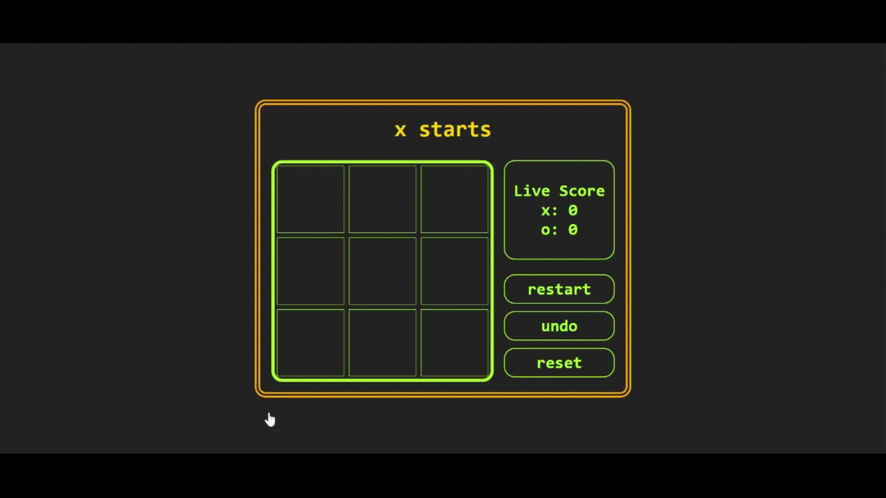

# A Simple :o:`TIC-TAC-TOE`:x: Game created using `create-react-app` :gem:

## :roller_coaster: Game Page In Action  :blush:

## :bulb: Idea For The Project :grinning:
 A big thanks :gift_heart: to React official website's [Tutorial](https://react.dev/learn/tutorial-tic-tac-toe) on how to build a `tic-tac-toe` game.

## :sparkles: Features :nerd_face:
This project, although created with the help of tutorial, contains some extended features: 
* Minimalistic **dark mode UI**
* `undo`, `restart`, `reset` functionalities available
* Live displaying of player scores, for both `player x` and `player o`
* **Coloured squares** to represent the winning squares in case a player wins

## :rocket: Deployment :grin:
* The full project is deployed on [github pages](https://soumyajit0803.github.io/tic-tac-toe/)

## :dart: Game Rules! :video_game:
 * `x` starts the game, followed by `o` and so on till result is obtained
 * At any point, the ongoing match can be made to `undo` as per players' wishes
 * On winning, the winner's score is **incremented**. The game is `restart`ed after every match. In this way, both players will continue playing as long as they wish.
 * Finally the game can be `reset` to **erase all data** and start again.

 ## :key: License 
 This project is under [MIT License](./LICENSE)